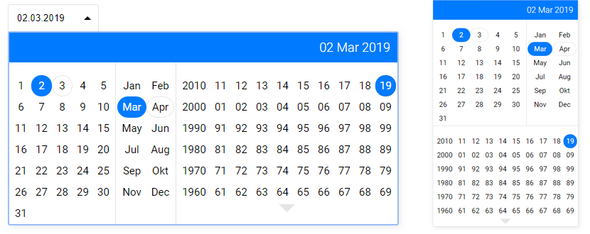

# vueBirthDatepicker
Date picker for distant dates, such as birthday.
Just three clicks to choose any month and day 20 or 50 years ago.


## [DEMO](http://mkant.ru/mink-js/vue-birth-datepicker/)

## Istallation
```javascript
npm i vue-birth-datepicker --S
```
## Inclusion to app
### Import ES6
```javascript
import birthDatepicker from 'vue-date-picker';
// include 'vue-date-picker/dist/vueBirthDatepicker.css' into your styles
```

### Import with vue-loader and scss-loader
```javascript
import birthDatepicker from 'vue-date-picker/src';
```
Don't need to include styles separately in this case

### Browser
```html
<script src="https://unpkg.com/vue"></script>
<script src="./vueBirthDatepicker.umd.js"></script>
<link rel="stylesheet" href="./vueBirthDatepicker.css">
```

## Usage
```html
<birth-datepicker v-model="date" />
```

## Attributes
Configure datepicker look and behaviour with attributes
<table>
 <tr>
   <th>attribute</th>
   <th>type</th>
   <th>default value</th>
   <th>description</th>
 </tr>
 <tr>
   <td>valueIsString</td>
   <td>boolean</td>
   <td>false</td>
   <td>If "true", value is a string of format depending on other attributes, by default like "1990.12.31". If "false" value is a unix milliseconds timestamp for local date 00 hours 00 minutes.</td>
 </tr>
 <tr>
   <td>inline</td>
   <td>boolean</td>
   <td>false</td>
   <td>If "true", widget is shown as inline-block element. Otherwise as an input with opening dropdown.</td>
 </tr>
 <tr>
   <td>high</td>
   <td>boolean</td>
   <td>false</td>
   <td>High dropdown view. If "true", months and days are above years. Otherwise all in one row.</td>
 </tr>
 <tr>
   <td>hideHeader</td>
   <td>boolean</td>
   <td>false</td>
   <td>If "true", no header in dropdown will be shown.</td>
 </tr>
 <tr>
   <td>closeOnSet</td>
   <td>boolean</td>
   <td>false</td>
   <td>If "true", dropdown will be automatically closed on select. Does not work in "inline" mode.</td>
 </tr>
 <tr>
   <td>placeholder</td>
   <td>string</td>
   <td>''</td>
   <td>Input placeholder. Does not work in "inline" mode.</td>
 </tr>
 <tr>
   <td>attachment</td>
   <td>string</td>
   <td>'bottom left'</td>
   <td>Placement of dropdown. Does not work in "inline" mode.</td>
 </tr>
 <tr>
   <td>yearFirst</td>
   <td>boolean</td>
   <td>false</td>
   <td>If 'true', date will be displayed like '1970.12.31' otherwise like '31.12.1970'</td>
 </tr>
 <tr>
   <td>delimiter</td>
   <td>string</td>
   <td>'.'</td>
   <td>Symbol between digits</td>
 </tr>
 <tr>
   <td>maxYear</td>
   <td>number</td>
   <td>current year</td>
   <td>Maximum year value available to display and to choose. Undefined means unlimited.</td>
 </tr>
 <tr>
   <td>minYear</td>
   <td>number</td>
   <td>undefined</td>
   <td>Minimum year value available to choose. Undefined means unlimited.</td>
 </tr>
 <tr>
   <td>locale</td>
   <td>string, array</td>
   <td>'en'</td>
   <td>Names of months. English and Russian locales are embeded, so you can specify 'en' or 'ru'. You can provide month names as an array, beginning with January name</td>
 </tr>
</table>
